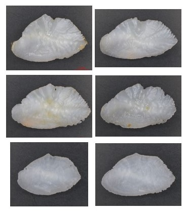

# Fish Otolith Aging with Multi-Modal Data: Image, Spectra, and Metadata
This is the repository for our work on automated fish otolith aging using deep learning.  This repo consists of 5 chapters detailing how we develop and train our deep learning models for fish age prediction using three different data modalities.

Our work **Automatic Fish Age Prediction using Deep Machine Learning: Combining Otolith Image, NIR Spectra and Metadata Features** has been accepted to the 3rd Workshop on Maritime Computer Vision (MaCVi) hosted at WACV 2025!

## Data Preprocessing
We have otolith data collected for two commercially important fish species: Walleye Pollock and Red Snapper.  Our data consists of whole otolith image, otolith FT-NIR spectra, and associated metadata like otolith weight, catch location, etc.

*Pollock Otolith Images*

