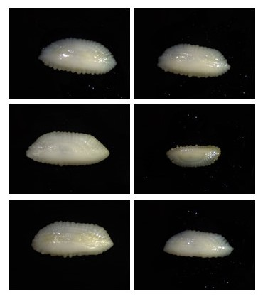
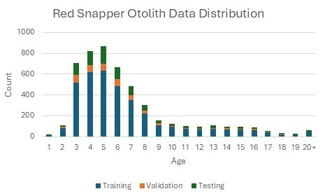
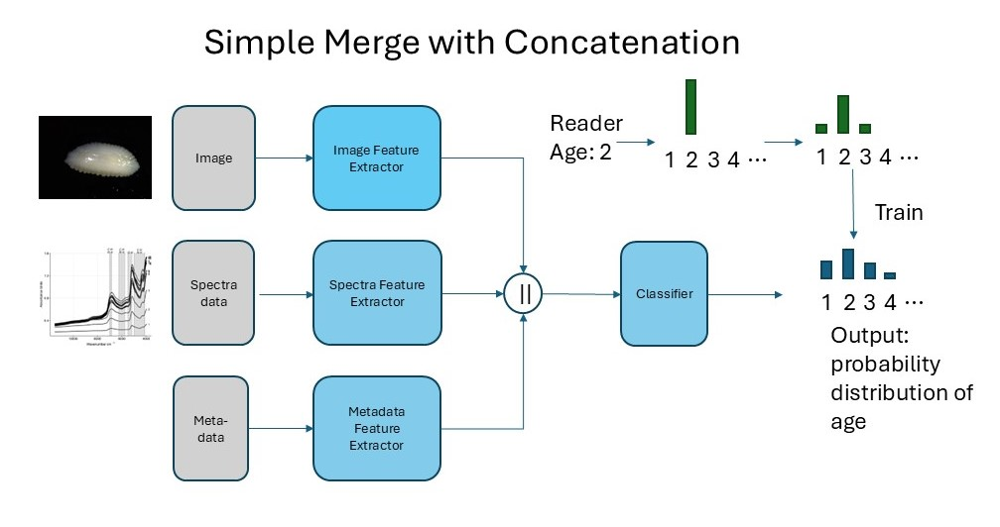
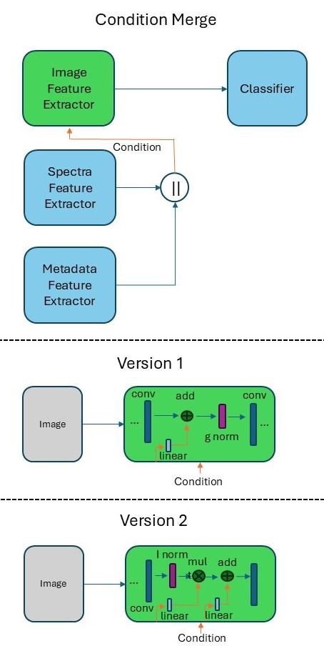

# Fish Otolith Aging with Multi-Modal Data: Image, Spectra, and Metadata
This is the repository for our work on automated fish otolith aging using deep learning.  This repo consists of 5 jupyter notebook files split into chapters detailing how we develop and train our deep learning models for fish age prediction using three different data modalities.

Our work **Automatic Fish Age Prediction using Deep Machine Learning: Combining Otolith Image, NIR Spectra and Metadata Features** has been accepted to the 3rd Workshop on Maritime Computer Vision (MaCVi) hosted at WACV 2025!

## Chapter 1 - Data Preprocessing
We have otolith data collected for two commercially important fish species: Walleye Pollock and Red Snapper.  Our data consists of whole otolith image, otolith FT-NIR spectra, and associated metadata like otolith weight, catch location, etc.
Before we can use our data for fish aging, we first have to process the otolith images to zoom in and crop around the otolith.

*Pollock Otolith Images*

*Pollock Data Age Distribution*

*Red Snapper Otolith Images*

*Red Snapper Data Age Distribution*

## Chapter 2 - Image Based Aging
Here we train a simple image based age classification model to predict fish age class based solely on the whole otolith image.  Additionally, we go over how to use different types of image backbones to test which work the best.

## Chapter 3 - Multi-Modal Simple Merge
In this chapter, we train a multi-modal modal using all three data types as input.  In this simple merge architecture, we have three input branches for feature extraction, one for each data modality.
After the feature extration, the three different embedding features are concatenated together before being fed to a final classification layer.

*Simple Merge Architecture*

## Chapter 4 - Complex Condition Based Merging
In this chapter, we try a more complicated way to merge the three data modalities taking inspiration from image generation.  We call this method condition merge, where the spectra and metadata embedding features are used as conditions in the image feature extraction process.

*Condition Merge Architecture*

## Chapter 5 - Image Feature Attribution